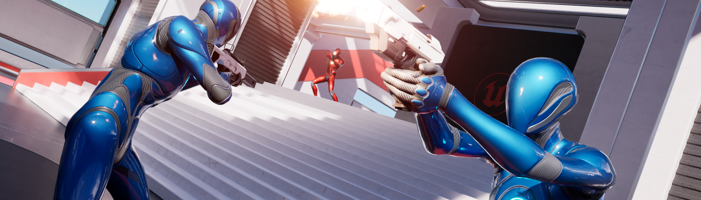

# Lyra Sample Game

## What is Lyra?

> Lyra is a learning resource designed as a sample game project to help you **understand the frameworks of Unreal Engine 5** (UE5).
>
> Its architecture is designed to be **modular**, including a core system and plugins that are updated regularly along with the development of UE5.

## Useful links

### Documentation

- [Unreal Engine - Lyra Sample Game](https://docs.unrealengine.com/5.3/en-US/lyra-sample-game-in-unreal-engine/)
- [X157 Dev Notes - Build your Game on Lyra](https://x157.github.io/UE5/LyraStarterGame/)

### YouTube Playlists

- [LeafBranchGames - Exploring Lyra > YouTube](https://www.youtube.com/playlist?list=PLNBX4kIrA68lSY6Pj3zDVH6kGDIMgwOvr)
- [Bastian Dev - Create a game based on Unreal Lyra > YouTube](https://youtube.com/playlist?list=PLK0EcCQf_rrZUfro2vlwFLQ1Y8itOVSgd&si=C7AJvMOy0HMm_V2U)

### Discord

[Lyra Dev Network](https://discord.gg/RS99Jcur6q)
