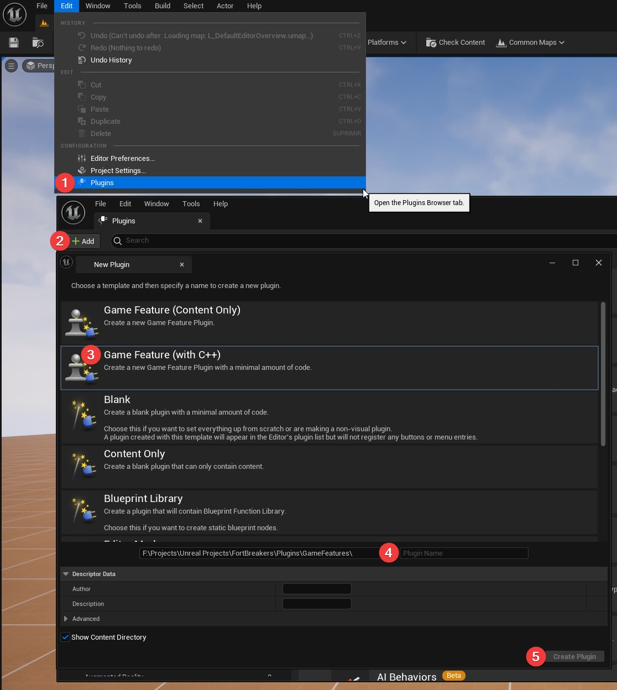

# Create a Game Feature plugin

1. First go to `Edit > Plugins`.
2. Click on the `+Add` button.
3. Select `Game Feature (with C++)` from the list.
4. Give your plugin a `name`.
5. Click the `Create plugin` button.

### Next steps <!-- {docsify-ignore} -->

Now create a new [Lyra Map](/lyra/lyra-new-map).
