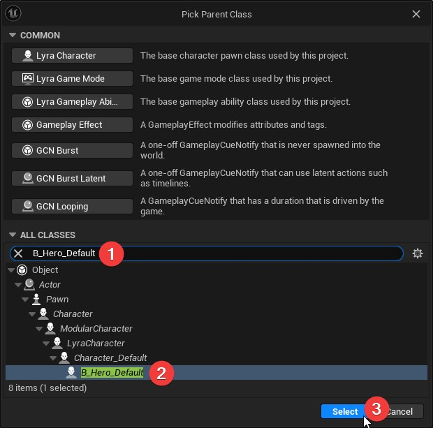
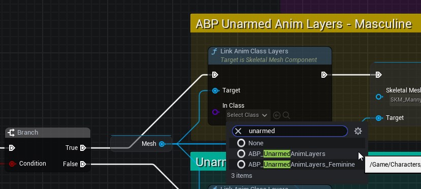
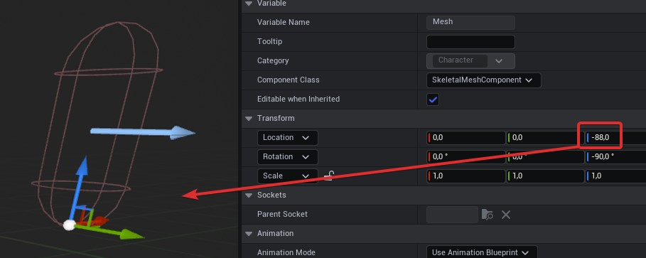

# Create a Lyra Character

1. First create a folder in your Plugin with the name `Characters`.
2. Enter the folder, right click and create `Blueprint Class`.
3. Create a new blueprint based on `B_Hero_Default`.
4. Name it `BP_XX_Hero` *(Replace XX with your plugin initials)*.

## Editing the Character blueprint

> **Note:** For this example we are following Bastian Dev tutorial

1. Start by adding the component `B Mannequin Pawn Cosmetics`.
2. Next go to the Event Graph.
3. For ease of use we are going to use DevBastian approach for `OnCharacterPartsChanged`

* [Available in this link.](https://blueprintue.com/blueprint/r5mkcql7/)

4. Scroll down to the `Code to copy` section and click the Copy icon.
5. Go back to the Event Graph and paste the Blueprint nodes with `Ctrl + v`.
6. In the comment section for `ABP Unarmed Anim Layers - Masculine` look for the `true` execution node `Link anim class Layers`.
7. Set the class to `ABP_UnarmedAnimLayers` and for the `false` execution node `ABP_UnarmedAnimLayers_Feminine`

In the Viewport, select the `Mesh` and change the `Location Z value` to -88 to reposition the pivot to the base of the object.

Lastly go to the `Class Defaults` and under `Animation > Anim Class` set the default to `ABP_Mannequin_Base`.

With these changes the character is ready.

## Resources

[Bastian Dev - YouTube > Lyra Character creation](https://youtu.be/hO8OWLWLD6o?si=Z_qkSje1nfb1ndEW&t=226)
