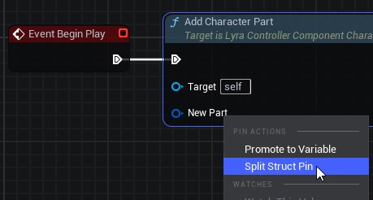

# Controller Component & Character Parts

> **Lyra Controller Component** is a part of the character customization system in Lyra.
>
> Controller Component plays a crucial role in determining which **Character Parts** are associated with a given Pawn.

**Lyra Controller Component works in conjunction with two other components:**

* **Character Parts:** These are the visual building blocks of your character, like heads, torsos, legs, and accessories. Lyra offers both pre-defined full body characters and a modular system where you can mix and match parts.
* **Pawn Component:** This component lives on both the server and all the clients in a multiplayer game. It receives instructions from the Controller Component (server-side) on which character parts to display and replicates that information to all players.

## Functionality features

* **Dynamic Selection:** The Controller Component dynamically selects the appropriate Character Parts based on the specific Pawn. This allows for flexibility and customization, ensuring that each Pawn can have a unique combination of parts.
* **Blueprint Integration:** In Lyra, the Controller Component’s logic is often implemented using Blueprint. This means that designers and developers can easily configure and adjust the Character Parts for different Pawns without diving into code.

## Create the Lyra Character Parts

> **Note:** For this example we are following Bastian Dev tutorial

1. Go to your plugin's `Characters` folder.
2. Right click and create a Blueprint based on the class `LyraControllercomponent_CharacterParts`.
3. Name it `BP_XX_CharParts`. *(Replace XX with your plugin initials)*
4. Open it and from `Begin Play` drag a node and search for `Add Character Part`
5. Right click on top of `New part` in the `Add character Part` function node and select `Split Struct Pin`.

6. Select the dropdown for `New part part class` and search for `B_Manny`.
7. Compile and Save the Character Parts Blueprint.

## Resources

[Lyra Controller Component documentation by Xist](https://x157.github.io/UE5/LyraStarterGame/CharacterParts/ControllerComponent.html)

[Lyra Character Parts documentation by Xist](https://x157.github.io/UE5/LyraStarterGame/CharacterParts/)

[Lyra Chracter Parts video by Xist](https://www.youtube.com/watch?v=PYZmQPkvY5M)

[Bastian Dev - YouTube > Character Parts creation](https://youtu.be/hO8OWLWLD6o?si=Z_qkSje1nfb1ndEW&t=485s)
