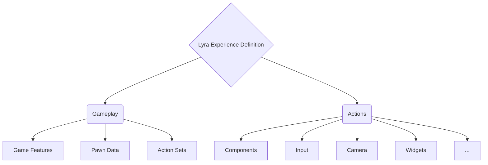

# Lyra Experience Definition

> It acts as a blueprint for defining the specific gameplay experience within your Lyra project.
>
> An Experience Definition encapsulates various aspects of the game, including character abilities, interactions, and overall design.
>
> Understanding Experience Definitions is crucial when working with Lyra, as they **define the core gameplay experience** for your project.

## Blueprint-Based Design

Unlike traditional data assets, the Lyra Experience Definition is implemented as a **Blueprint**.
This choice allows for **flexibility and dynamic adjustments** during runtime.
Designers and content creators can easily modify and extend the experience without touching code.

## Components

## Create a Lyra Experience Definition

1. Go to the root of your Game Feature plugin.
2. Right click and create a new fo folder named `Experiences` to keep them organized.
3. Right click and create a new Blueprint based on the class `LyraExperienceDefinition`.
4. Name it with the sufix `_Experience`.
   * E.g. `BP_XX_Experience`. *(Replace XX with your plugin initials)*.
5. Open the Blueprint and under `Gameplay > Game features to enable` write the name of your plugin. This is exactly as the name of your plugin folder but without the "Content" at the end.
6. Set the `Pawn Data` to the [Pawn Data you created](/lyra/lyra-pawn-data?id=creating-a-pawn-data-asset).

> **Note:** For this example we are following Bastian Dev tutorial

6. Under `Actions` add an Action to `Add Components`.
7. Click the `+` icon on the `Component List` to add an entry.
8. Expand the item and set:
   * `Actor Class` to `Controller`.
   * `Component Class` to `BP_XX_CharParts` *([This is the Character Parts you created](/lyra/lyra-controller-component-character-parts?id=create-the-lyra-character-parts))*
   * `Client Component` to [ ] unchecked.
   * `Server Component` to [x] Checked.
9. Save the Experience Definition Blueprint.

### List of possible Actions

## Add Experience Definition to the Game Asset Manager

1. In your Editor select `Edit > Project Settings`.
2. Under `Game > Asset Manager` look for the `Primary Asset Types to Scan`.
3. Expand the one that displays `LyraExperienceDefinition`.
4. In `Directories` add an entry and select the `Experiences` folder inside your plugin.

## Set Default Experience for your Map

1. Open your Map level.
2. Go to `World Settings`.
3. Under `Game Mode > Default Gameplay Experience` set value to your own Experience Definition.

## Resources

[Xist - Lyra Experience Definition docs](https://x157.github.io/UE5/LyraStarterGame/Experience/)

[Bastian Dev - YouTube > Lyra Experience Definition creation](https://youtu.be/hO8OWLWLD6o?si=Z_qkSje1nfb1ndEW&t=582s)

[LeafBranchGames - YouTube > Exploring Lyra - Part 6 (Experiences)](https://www.youtube.com/watch?v=RgthSITmFo0)
