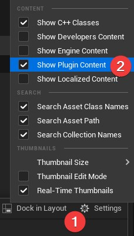
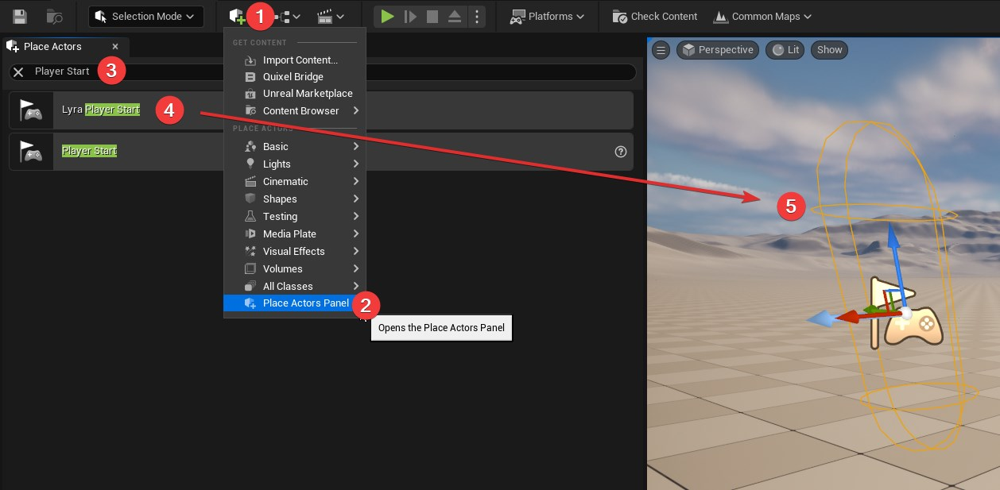

# Lyra - Creating an New Map

## Preparation

After you have created the [Game Feature Plugin](/lyra/game-feature-plugin).

Be sure to enable `Show Engine Content` in the Content Drawer Settings.

## Create the map

We are going to create the default map for our new plugin.

1. Select `File > New level`.
2. Pick you New level type, likely Open World (or Empty level if you preferer).
3. Select `File > Save Current Level`.
4. Select the Plugins folder and go to the folder with your `Plugin name`.
5. Create a new folder called `Maps`.
6. Name your new map `L_Default_XX`. *(Replace XX with two letters that relate to your `Plugin name`)*;
7. Click the `Save button`.

## Add a Player Start in the new map

The player needs to start somewhere in the map so we just add a `Lyra Player Start` game object in our new map.

1. Click the `Add content` button.
2. Select `Place Actors Panel`.
3. Search for `Player Start`.
4. Click and drag `Lyra Player Start`.
5. Place the `Lyra Player Start` in a section of the new map.
6. Select `File > Save Current Level`.

## Define default map in Project Settings

1. Select `Edit > Project Settings`.
2. Select `Project Maps & Modes`.
3. Set the `Editor Startup Map` and `Game Default Map` to the new map created.

## Resources

[Bastian Dev - YouTube > Lyra Map creation](https://youtu.be/hO8OWLWLD6o?si=Z_qkSje1nfb1ndEW&t=151s)
