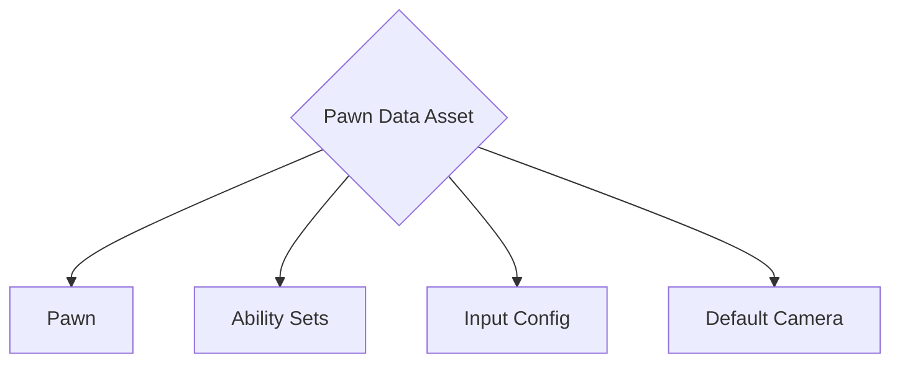

# Create a Lyra Pawn Data

> The LyraPawnData Data Asset acts like a blueprint that stores various settings related to the character, essentially telling the game **what the character is and how it behaves**.
>
> Defines which pawn the game mode should spawn, as well as Ability Sets, Input Config, and the Default Camera Mode.

## Pawn Data Asset Components

## Key aspects configured in a Lyra Pawn Data asset

**Pawn Class:** This specifies the actual character class that will be spawned for the player or AI controlled entity. You can choose from existing character classes within Lyra or create your own custom class.

**Ability Sets:**  These define the abilities that the character can use.  An ability set is a collection of abilities that the character can access and activate. You can assign different ability sets to different Pawn Data assets, allowing you to create diverse character types with unique skills.

**Input Config:** This configures how player input translates to character actions. It defines how button presses and joystick movements map to specific actions within the game, such as movement, jumping, or using abilities.

**Default Camera Mode:** This determines the initial camera perspective for the character.  In Lyra, common options include third-person and first-person views.

## Creating a Pawn Data Asset

1. Go to the root of your plugin's folder.
2. Right click and select `Miscellaneous > Data Asset`.
3. Pick the `Lyra Pawn Data` class and click the Select button.
4. Name the new data asset wit the prefix `DA_`, then your plugin initials and PawnData.
   - E.g. `DA_XX_PawnData`.

## Configure your Pawn Data

1. Open your Pawn Data file.
2. For `Pawn` select the [Character you created](/lyra/lyra-character).
3. For `Input` select `InputData_Hero`.
4. For `Camera Mode` select `CM_ThirdPerson`.
5. Save the Pawn Data file.

(Note currently we are not setting the `Ability Sets`, related page likely coming soon)

[//]: # (// TODO: Link ability set page)

## Resources

[Bastian Dev - YouTube > Pawn Data creation](https://youtu.be/hO8OWLWLD6o?si=Z_qkSje1nfb1ndEW&t=436s)
